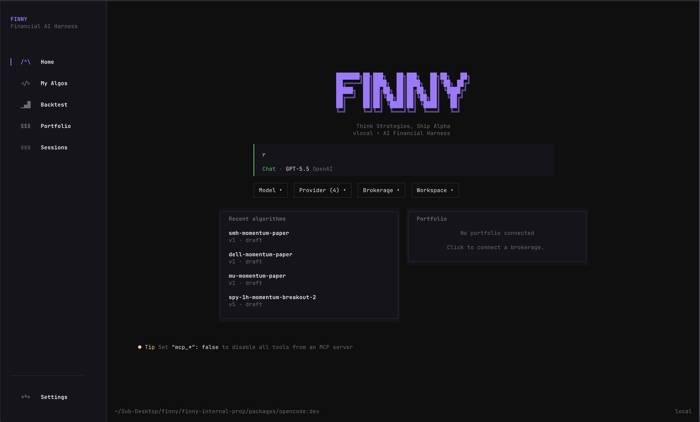
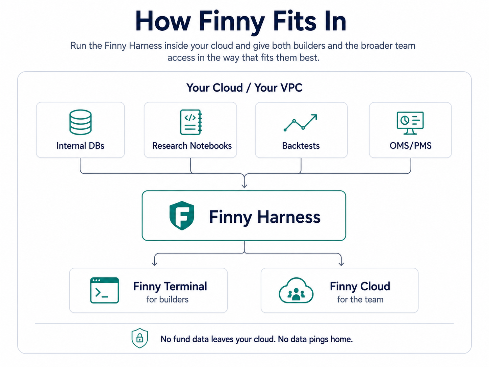

<div align="center">

<picture>
  <source media="(prefers-color-scheme: dark)" srcset=".github/assets/finny-logo-dark.png" />
  <source media="(prefers-color-scheme: light)" srcset=".github/assets/finny-logo.png" />
  
</picture>

# Finny

**An AI financial harness for systematic trading.**

Describe a strategy in plain English. Finny researches it, writes it, and then
tries as hard as it can to prove it doesn't work.

<a href="#quick-start"></a>


<br />

**[Docs](https://www.finnyai.tech/docs)** ·
**[Blog](https://www.finnyai.tech/blog)** ·
**[Discord](https://discord.com/invite/XrJ4yFYf7P)**

**Products —**
[CLI Pro](https://www.finnyai.tech/products/cli-pro) ·
[Cloud](https://www.finnyai.tech/products/cloud) ·
[Ops Agent](https://www.finnyai.tech/products/ops-agent)

<br />



</div>

---

## Contents

1. [Why](#why)
2. [Quick start](#quick-start)
3. [How it fits in](#how-it-fits-in)
4. [Agents](#agents)
5. [Crucible 2.0](#crucible-20)
6. [Strategy templates](#strategy-templates)
7. [Validation](#validation)
8. [Repo map](#repo-map)
9. [Development](#development)
10. [License](#license)

---

## Why

An LLM will happily hand you a strategy with a 4.2 Sharpe. Almost always it is
lookahead bias, an overfit parameter sweep, or a survivorship artifact — and the
model has no idea.

Finny's useful work is not generating strategies. It is **refusing to believe
them.** Every run carries an immutable, hash-bound data snapshot; coverage is
reconciled against the real market calendar; the backtest will not start on
repaired or synthetic data; and the verdict is deterministic.

The expected honest outcome of most ideas is `research_only`. That is the
feature.

---

## Quick start

```bash
curl -fsSL https://finnyai.tech/cli/install | bash
finny
```

Or via npm — the same public package the installer pulls:

```bash
npm i -g finny
finny
```

> **Try it:** _"Build me a momentum-based ETH strategy with RSI signals and walk-forward it."_

**BYOK.** Bring your own keys — Anthropic, OpenAI, Google, or a local model.
Config lives in XDG-compliant paths:

```
~/.config/finny/       # configuration
~/.local/share/finny/  # data
```

---

## How it fits in

<div align="center">

</div>

The harness runs where your data already lives. This repository builds that
harness — the `finny` binary and its Python engine — and it is the shared core
behind both surfaces: the terminal you run locally, and Finny Cloud, which
embeds the same harness and opens it up to the wider team. `finny serve`
exposes the HTTP API they talk to.

Only the harness is built here. The Cloud web front-end is a separate
deployment that consumes it.

---

## Agents

Finny runs a single strategy controller. It clarifies the thesis, coordinates
evidence, scaffolds and saves strategy versions, runs the gauntlet, and reports
honestly. It is sandboxed — no shell access.

It delegates to four specialists, used when they materially improve the
strategy rather than as a fixed ritual:

| Specialist | Returns |
| --- | --- |
| **Data Extractor** | OHLCV artifacts plus a coverage, quality, and regime digest |
| **News Researcher** | Catalysts, execution context, provenance, risk regime — cited only |
| **SEC Filings** | EDGAR filings, ownership, insiders, institutions |
| **Sentiment Analysis** | Aggregate crowd positioning and attention |

None of them can create strategies, run backtests, or decide that partial data
is good enough.

---

## Crucible 2.0

`finny_backtest` runs the full gauntlet, not a single backtest:

| Stage | Purpose |
| --- | --- |
| Base backtest | Return, Sharpe, max drawdown, win rate, profit factor |
| Walk-forward | Stitched out-of-sample performance |
| Consistency | Stability across folds |
| Alpha decay | Does the edge survive over time |
| Robustness | Parameter and Monte Carlo perturbation |
| Verdict | Deterministic — `research_only`, `candidate`, or `recommended_for_paper` |
| Review packet | `review.md` / `review.html` for human sign-off |

**Crucible 2.0 collects its own data.** It reconciles coverage against the exchange
calendar — weekends, holidays, half-days, and open final bars are calendar
facts, not gaps — freezes a content-hashed snapshot, and only then runs the
engine. Missing ranges are repaired surgically; unsafe cross-provider stitching
is refused.

`recommended_for_paper` requires the verdict *and* three persisted values above
zero: total return, stitched walk-forward OOS return, and alpha over
buy-and-hold. Promotion to paper is always an explicit human call.

---

## Strategy templates

Fourteen ready-made starting points:

| | | |
| --- | --- | --- |
| `momentum` — RSI | `mean-reversion` — Bollinger | `breakout` — Donchian |
| `golden-cross` — SMA 50/200 | `macd` — signal crossover | `atr-breakout` — range expansion |
| `vwap-reversion` — session-anchored | `z-score` — normalized distance | `keltner` — EMA ± ATR |
| `adx-trend` — strength-filtered | `supertrend` — ATR band flip | `ttm-squeeze` — compression release |
| `ou-reversion` — half-life filtered | `tsmom-vol` — vol-targeted TSMOM | |

### Or describe your own

You are not limited to the list. Ask for a strategy that doesn't exist yet and
Finny scaffolds a `custom` skeleton, walks you through its decision points, and
implements **your** entry, exit, session filters, and risk rules.

> _"Only go long when the 4h trend is up, enter on a 15m pullback to VWAP, hard
> stop at 1.5 ATR, and flatten before the close."_

It will not quietly swap in a strategy family it likes better and rebrand it —
your rules win.

---

## Validation

Every generated strategy is checked before it can run:

- **Syntax** and **Strategy class shape** — `Strategy(broker, params=None)`, `on_bar(self, symbol, bar)`
- **Forbidden imports** — `os`, `sys`, `subprocess`, `socket`, `requests`, `shutil`
- **Dangerous calls** — `exec`, `eval`, `compile`, `__import__`
- **Lookahead** — only `bar["open"]` is decision-time-safe on the current bar; indicators must use prior bars
- **Trading pitfalls** — unbounded lists, division by zero

Validation warnings mean the strategy is not runnable. There is no override.

---

## Repo map

Everything in this repository, one line each.

### `packages/`

| Package | What it is |
| --- | --- |
| **`opencode`** | **The Finny CLI.** Agents, tools, Crucible, the Python engine, data providers, qualification. This is the product. |
| `tui` | Terminal UI (Solid.js + OpenTUI) |
| `core` | Session, storage, config, database |
| `llm` | Provider and model adapters |
| `server` | HTTP API |
| `sdk` | Generated TypeScript client — also the public plugin type surface |
| `plugin` | Plugin host interfaces |
| `finny-core` | Prefs, algo policy, tool guards |
| `finny-integrations` | Broker and data integrations |
| `finny-registry` | Strategy and capability registry |
| `http-recorder` | HTTP record/replay for tests |
| `effect-drizzle-sqlite`, `effect-sqlite-node` | SQLite layers for Effect |
| `script` | Shared build helpers |

### Inside `packages/opencode/src`

| Path | What it is |
| --- | --- |
| `backtest/` | **Crucible** — run integrity, experiment locking, qualification gates, verdicts, review packets |
| `algorithm/` | Strategy model, validation, build workflow |
| `data/` | Provider fetch, coverage reconciliation, dataset evidence |
| `agent/` | Agent roster and prompts |
| `tool/` | Model-facing tools (`finny_backtest`, `finny_algorithm_*`, workspace) |
| `live/` | Live and paper trading runner |
| `finnybench/` | Harness quality benchmark |

`packages/opencode/engine_v2/` is the Python engine — calendars, providers,
execution, metrics.

### Root

| Path | What it is |
| --- | --- |
| `algos/` | Strategy templates — **read `algos/_template/README.md` before writing a strategy** |
| `convex/` | Cloud storage schema and functions |
| `data-agent/` | Data Agent cookbook |
| `docs/`, `specs/` | Design notes and workflow specs |
| `script/` | Dev helpers, notably `sync-upstream.sh` |
| `patches/` | Pinned dependency patches |
| `docker/`, `Dockerfile.railway` | Railway agent deployment |

---

## Development

```bash
git clone https://github.com/Jaiminp007/finny-v2.git
cd finny-v2

bun i
bun run dev   # launch the TUI
```

---

## License

Source-available under the [Finny Source-Available License 1.0](./LICENSE)
(PolyForm Noncommercial 1.0.0 with Additional Conditions). You may read the
source and use official releases freely. Forks must publish their changes
within 30 days. Nobody may host Finny as a service for others. Commercial use
requires a separate agreement.

The original OpenCode codebase is MIT. Built on
[OpenCode](https://github.com/anomalyco/opencode) by
[Anomaly](https://github.com/anomalyco).
